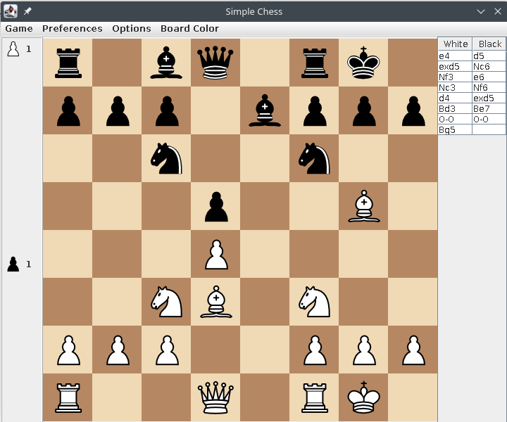

A simple 2 player chess AI that implemented minimax & alpha-beta pruning & move-ordering to fully optimise the AI with a slightly different FEN file format

I screwed up my previous chess game with bad design and without planning ahead

## Folder Structure

The workspace contains two folders by default, where:

- `src`: the folder to maintain sources

## To play the Game
NOTE: **The image dragged is a bit low quality as image of piece is added to cursor**
No. | Steps
--- | ----
1.| Open Intellij Project.jar program
2.| User can choose to play as white/black
3.| User can choose white/black as AI
4.| Or, user can watch AI play against itself
5.| Once the game started, press(not click) the piece you wish to move, drag and drop to the square you wish to place it
6.| The piece will move as user drag

## Game Features

NOTE: **if AI move is undo, press its piece so AI can move again**

No. | Features
--- | ----
1.| Restart new game
2.| Save game/ Load saved game
3.| Exit game
4.| Highlight legal moves
5.| Show move history
6.| Choose AI level from 1 to 5
7.| Show captured piece
8.| Show AI thinking progress bar
9.| Undo previous move
10.| Multithread feature depends on the number of cores of a pc, the greater the better/faster AI can think
11.| Flip board

